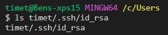
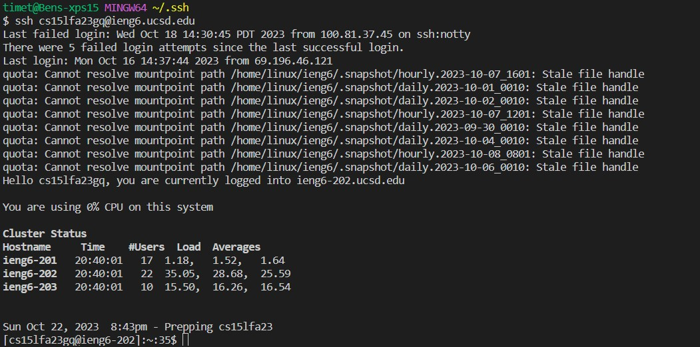

# Lab Report 2

## Part 1
Code for String Server:
 

 

 
One word added:
 

 
The method that is called is the `handleRequest` method. It takes in the URL shown the image above as an arguement. The URL is then spliced into the String array named `args`. The element at index 0 is "s". The element at index one which in this case is the String "hey".The program then takes the current string that is being displayed by the site, adds a new line, adds to the `num` field which gets increased to 1, starts a new line with that number value and a period, and finally adds the new String input. This modified the s field which is the field that holds all the strings and their corresponding number. 
 

 
Two words added:
 

 
The method that is called is the `handleRequest` method. It takes in the URL shown the image above as an arguement. The URL is then spliced into the String array named `args`. The element at index 0 is "s". The element at index one which in this case is the String "whatsup".The program then takes the current string that is being displayed by the site, adds a new line, adds to the `num` field which gets increased to 2, starts a new line with that number value and a period, and finally adds the new String. This modified the s field which is the field that holds all the strings and their corresponding number. The field that is inside of args at index zero remained the same because it was another call to the /add-message querery. 

 

## Part 2
 
Path to my private key on my personal computer using the ls command:
 

 
Path to public key for loging onto ieng6:

 
Loging into ieng6 without being prompted for my password:

 

## Part 3
In the week 2 lab I learned that the "java" command can be used to start a server. In the past I thought it was simpely used to excute what is within the main method, but in lab 2 I learned it had the additional application of also starting up a server. I find it interesting because the args array that takes in the arguements in the java command takes in the first element in the array as the server port. In the past I have only used it to take in words or a user's input.
