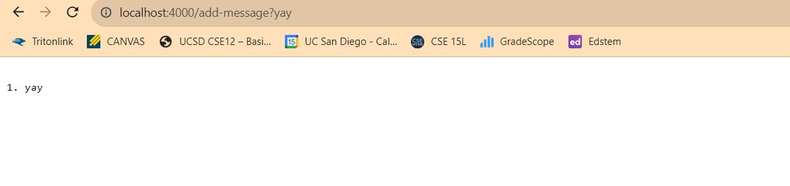
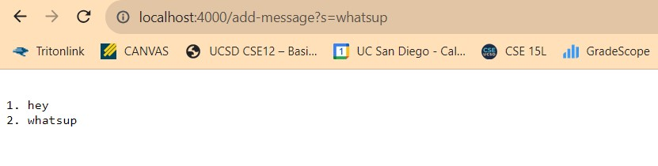

# Lab Report 2

## Part 1
Code for String Server:
 

 

 
One word added:
 

 
The method that is called is the handleRequest method. It takes in the URL as an arguement. The URL is then spliced into the String array named args. The element at index one which in this case is the String "yay".The program then takes the current string that is being displayed by the site, adds a new line, adds the number of strings up by one, starts a new line with that number value and a period, and finally adds the new String. This modified the s field which is the field that holds all the strings and their corresponding number. 
 

 
Two words added:
 

 
The method that is called is the handleRequest method. It takes in the URL as an arguement. The URL is then spliced into the String array named args. The element at index one which in this case is the String "sup".The program then takes the current string that is being displayed by the site, adds a new line, adds the number of strings up by one, starts a new line with that number value and a period, and finally adds the new String. This modified the s field which is the field that holds all the strings and their corresponding number. The field that is inside of args at index zero remained the same because it was another call to the /add-message querery. 

 

## Part 2

## Part 3
In the week 2 lab I learned that the "java" command can be used to start a server. In the past I thought it was simpely used to excute what is within the main method, but in lab 2 I learned it had the additional application of also starting up a server.
