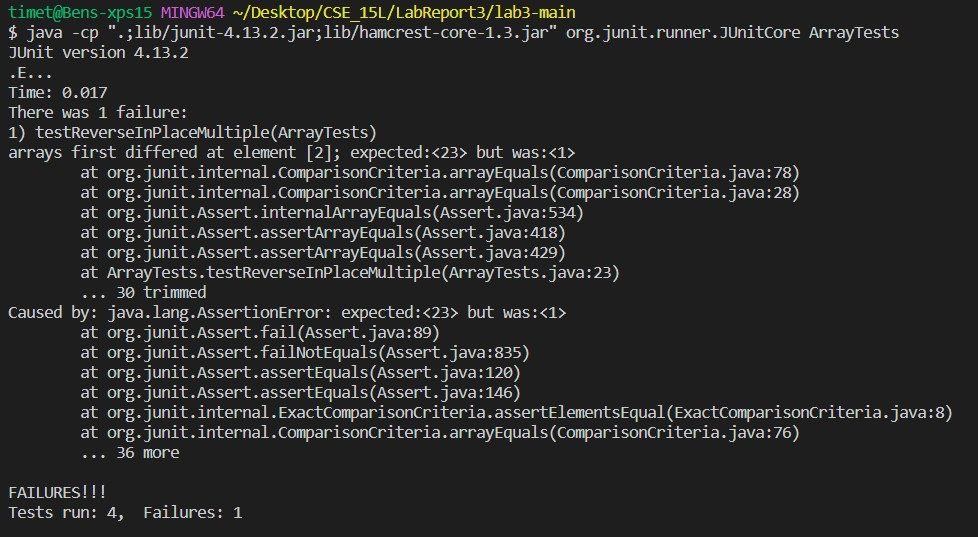

# Lab Report 3
## Part 1
Failure inducing intput:
```
@Test 
public void testReverseInPlaceMultiple(){
    int[] arr = {23, 32, 1};
    ArrayExamples.reverseInPlace(arr);
    assertArrayEquals(new int[]{1,32,23}, arr);
}
```
<br>
An input that doesn't induce failure:
```
@Test 
public void testReversedInPlaceSame(){
    int[] arr = {0, 0, 0, 0};
    ArrayExamples.reverseInPlace(arr);
    assertArrayEquals(new int[]{0,0,0,0}, arr);
}
```
<br>
Symptom of bug:

<br>
The buggy method before:
```
// Changes the input array to be in reversed order
static void reverseInPlace(int[] arr) {
    for(int i = 0; i < arr.length; i += 1) {
      arr[i] = arr[arr.length - i - 1];
    }
}
```
<br>
The buggy method after:
```
  // Changes the input array to be in reversed order
    static void reverseInPlace(int[] arr) {
    int k = 0;
    int temp = 0;
    for(int i = arr.length-1; i >= k; i--){
      temp = arr[k];
      arr[k] = arr[i];
      arr[i] = temp;
      k++;
    }
  }
```
<br>
My fix adresses the issue by having a ```temp``` variable that stores the value of one of the elements being swap so it is not lost like in the orginal version of the method.

## Part 2 - The "grep" command options
<br>
The "-l" option in the grep command only lists the file names that contian the found lines. Found from: https://www.geeksforgeeks.org/grep-command-in-unixlinux/
<br>
Example 1:
```
timet@Bens-xps15 MINGW64 ~/Desktop/CSE_15l/LabReport3/docsearch/technical (main)
$ grep -l "e" *
grep: 911report: Is a directory
grep: biomed: Is a directory
grep: government: Is a directory
grep: plos: Is a directory
```
<br>
In this example I searched for all the files that contian the letter e within the techinical directory. There are no files in this directory so it displayed all the directories that contian files with the letter e.
<br>
Example 2:
```
timet@Bens-xps15 MINGW64 ~/Desktop/CSE_15l/LabReport3/docsearch/technical/911report (main)
$ grep -l "e" *
chapter-1.txt
chapter-10.txt
chapter-11.txt
chapter-12.txt
chapter-13.1.txt
chapter-13.2.txt
chapter-13.3.txt
chapter-13.4.txt
chapter-13.5.txt
chapter-2.txt
chapter-3.txt
chapter-5.txt
chapter-6.txt
chapter-7.txt
chapter-8.txt
chapter-9.txt
preface.txt
```
<br>
In this example I displayed just the file names of the file that contained the letter e in the 911report directory.
<br>
This command is searching for all of the files that contian the given string. It can even print out the directories that contian the string. This is useful if you only want to know the files or directories that contian what your looking for and are not concered with their contents.

<br>
The "-o" option only prints the parts of the file that match the given line and what file that line is in. Found from: https://www.geeksforgeeks.org/grep-command-in-unixlinux/
<br>
Example 1:
```
timet@Bens-xps15 MINGW64 ~/Desktop/CSE_15l/LabReport3/docsearch/technical/911report (main)
$ grep -o "fast" *
chapter-1.txt:fast
chapter-1.txt:fast
chapter-1.txt:fast
chapter-11.txt:fast
chapter-12.txt:fast
chapter-13.1.txt:fast
chapter-13.1.txt:fast
chapter-3.txt:fast
chapter-3.txt:fast
chapter-6.txt:fast
chapter-6.txt:fast
chapter-6.txt:fast
```
Searched for "fast" and printed all the files that contian it and the part of the file that matched.
<br>
Example 2:
```
timet@Bens-xps15 MINGW64 ~/Desktop/CSE_15l/LabReport3/docsearch/technical/911report (main)
$ grep -o "zzz" *
```
<br>
In this example, grep did not find any files that contian "zzz" that matched.
<br>
This command prints out the file name that matches the given string and prints out the contents of the file that matches the string. This could be useful for seeing what specifically matches inside of the files.
<br>
The "-h" option does not show the file name and only shows the matched lines. Found from: https://www.geeksforgeeks.org/grep-command-in-unixlinux/
<br>
Example 1:
```
timet@Bens-xps15 MINGW64 ~/Desktop/CSE_15l/LabReport3/docsearch/technical/biomed (main)
$ grep -h "is not very" *
        adjusted for all covariates, is not very different (the
          The phyletic pattern of the CYTH domain is not very
        receptors. Plasmid DNA alone is not very efficient
        ballpark X over the past month. This average is not very
          protonated Schiff base. This is not very different from λ
          relationship between subunits is not very flexible. The
          reaction being catalyzed is not very demanding, or if the
```
<br>
In this example I displayed all of the lines that contian "is not very" within the biomed directory.
<br>
Example 2:
```
timet@Bens-xps15 MINGW64 ~/Desktop/CSE_15l/LabReport3/docsearch/technical/biomed (main)
$ grep -h "catch" *
        determined by Scatchard analysis with ELISA binding assays
          catch-all "don't know" category, rather than as a
          midline catches up to that in other areas of the
          catch-up after randomization. The time
          catch-up is the time when the number
          (catches-up to) the number of cases in the intervention
          catch-up only dilute the estimated
          catch-up does not occur if there is
          catch-up might not occur for a very
          Obrero hospital catchment areas were more well-to-do than
          Scatchard type binding described by:
          single site Scatchard type binding equation (see [ 1 ]
          Scatchard binding equation (eq. 3) must be used. This
            and resided within the HMO catchment area (see
          based on comparability with the hypothetical catchment
          or that fall into one of the catch-all subfamilies (such
```
<br>
In this example I displaced all the lines in all the files in the biomed directory that contian "catches".
<br>
This command is priniting out only the lines that contian the given search querery, not the file names. This could be useful if you are only concered with the lines of content that match and do not care about the file names.

<br>
The "-c" option prints only the count of lines that match the patern per file. Found from: https://www.geeksforgeeks.org/grep-command-in-unixlinux/
<br>
Example 1:
```
timet@Bens-xps15 MINGW64 ~/Desktop/CSE_15l/LabReport3/docsearch/technical/government/About_LSC (main)
$ grep -c "a" *
Comments_on_semiannual.txt:322
commission_report.txt:3543
conference_highlights.txt:238
CONFIG_STANDARDS.txt:230
diversity_priorities.txt:390
LegalServCorp_v_VelazquezDissent.txt:437
LegalServCorp_v_VelazquezOpinion.txt:418
LegalServCorp_v_VelazquezSyllabus.txt:111
ODonnell_et_al_v_LSCdecision.txt:94
ONTARIO_LEGAL_AID_SERIES.txt:539
Progress_report.txt:791
Protocol_Regarding_Access.txt:216
reporting_system.txt:286
Special_report_to_congress.txt:668
State_Planning_Report.txt:2480
State_Planning_Special_Report.txt:477
Strategic_report.txt:1112
```
<br>
In this example I searched for all the "a"s in all the files in the directory.
<br>
Example 2:
```
timet@Bens-xps15 MINGW64 ~/Desktop/CSE_15l/LabReport3/docsearch/technical/government/About_LSC (main)
$ grep -c " " *
Comments_on_semiannual.txt:342
commission_report.txt:3589
conference_highlights.txt:242
CONFIG_STANDARDS.txt:231
diversity_priorities.txt:394
LegalServCorp_v_VelazquezDissent.txt:455
LegalServCorp_v_VelazquezOpinion.txt:446
LegalServCorp_v_VelazquezSyllabus.txt:117
ODonnell_et_al_v_LSCdecision.txt:109
ONTARIO_LEGAL_AID_SERIES.txt:545
Progress_report.txt:816
Protocol_Regarding_Access.txt:225
reporting_system.txt:299
Special_report_to_congress.txt:676
State_Planning_Report.txt:2479
State_Planning_Special_Report.txt:495
Strategic_report.txt:1123
```
<br>
In this example I searched for the count of white spaces in all the files.
<br>
This command could be useful if you are only concered about the count of lines that contian a certian pattern. A more interesting use that is shown in example 2 is finding how many line contian at least one empty space.
