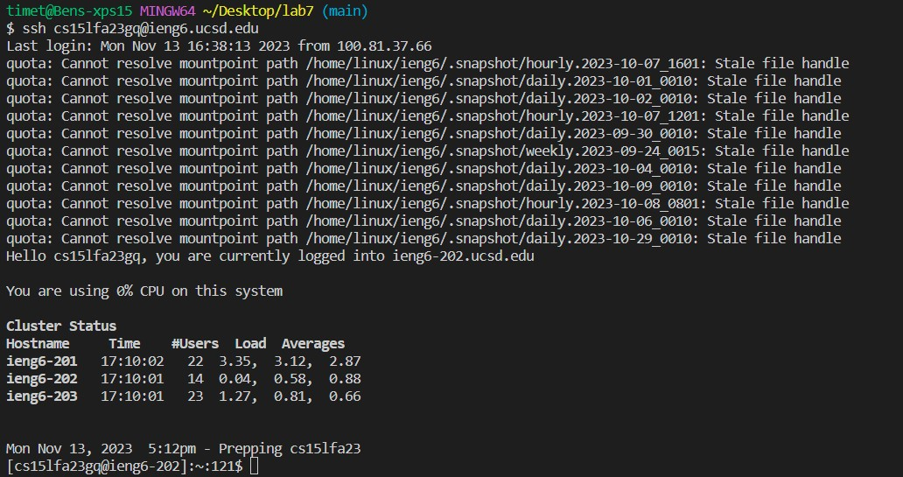
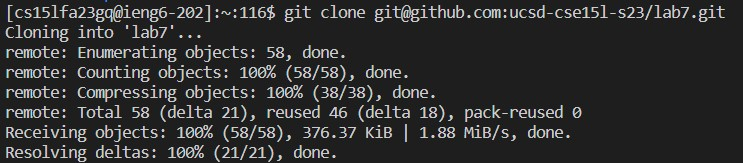
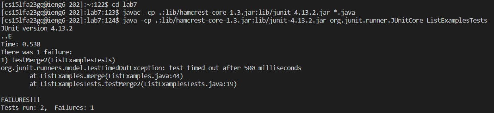
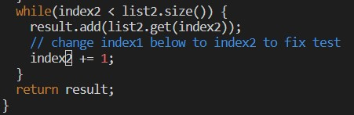
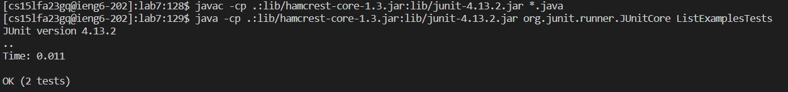
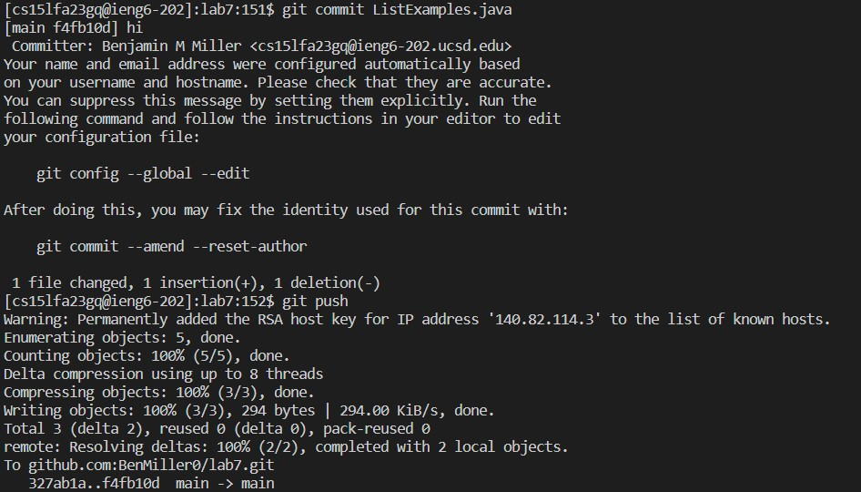

# Lab Report 4
(Steps 1-3 done untimed)

## Step 4

<br>
Typed out ```ssh cs15lfa23gq@ieng6.ucsd.edu``` `<enter>` from memory to remotly log into ieng6. Was able to not have to type in my password because of my key setup.

## Step 5

<br>
Typed ```git clone``` and then pasted the ssh github link to my fork of the lab7 repo ```git@github.com:BenMiller0/cse15l-lab-reports.git``` `<enter>`

## Step 6

<br>
Typed ```cd la``` and `<tab>` to auto complete it to ```cd lab7/``` and `<enter>`
<br>
Pasted ```javac -cp .:lib/hamcrest-core-1.3.jar:lib/junit-4.13.2.jar *.java``` `<enter>` and then ```java -cp .:lib/hamcrest-core-1.3.jar:lib/junit-4.13.2.jar org.junit.runner.JUnitCore``` from a txt file that contians commands I use alot. Had to complete the java command with ```ListExamplesTests``` so it ran the correct test file and I hit `<enter>`
<br>

## Step 7
 
<br>
Typed ```vim``` and then ```Lis``` and then used `<tab>` to fill autocomplete it to ```vim ListExamples``` and then typed ```.java``` to finish the command and then `<enter>`.
<br>


<br>
Typed ```/fix``` and `<enter>` to go to the comment above the line that needs to be fixed. Pressed `<down> <left> <left> <left> <left> <left> <left> <left>` to get to the number that needs to be replaced. Pressed `<r> <2>` to replace the one with a two. I then typed ```:wq``` `<enter>` to save and quit vim.

## Step 8
 
Pressed `<up> <up> <up>` to get the javac command from my history and run it again, ran it. Did `<up> <up> <up>` again to get the java command to run again. Saw that all test now succeed. 

## Step 9

<br>
Typed ```git commit Lis``` and pressed `<tab>` to autocomplete it to ```git commit ListExamples``` and then typed out ```.java``` to complete the command, and then `<enter>`. Pressed ```i``` to go into insert mode to write my commit message. Typed ```hi``` as my commit message, `<esc>` to exit insert mode, and then ```:wq``` `<enter>` to quit and save.
<br>
Typed out ```git push``` to finally push my changes to github.
