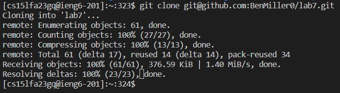

# Lab Report 4
(Steps 1-3 done untimed)

## Step 4

<br>
Typed out ssh command from memory as I have to use it alot to login to ieng5. Was able to not have to type in my password because of my key setup.

## Step 5

<br>
Typed git clone and then copy pasted the ssh link from my github fork.

## Step 6

<br>
Typed ```cd la``` and <tab> to auto complete it to ```cd lab3```
<br>
<up> <up> <up> <up> <up> <up> <up> 

## Step 7


## Step 8


## Step 9
