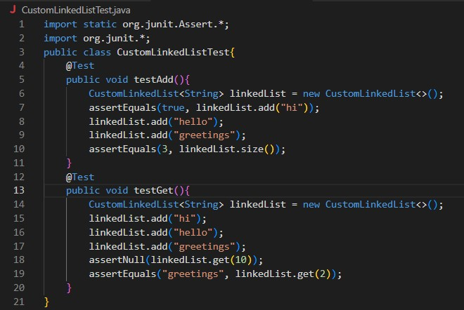

# Lab Report 5


## Part 1 - Debugging Senerio
<b> [Student Post] Something wrong with test.sh bash script </b>
<br> Hi! I am trying to write a bash script that compiles and runs JUnit tests on my ```CustomLinkedList.java``` file. It should put the output of the test runs into
a text file called ```results.txt```. Is there something wrong with the way I wrote my bash script? I cannot seem to get it to work properly.
<br>
Here is the terminal output when I run ```bash test.sh``` on my terminal:
<br>

<br>
This is the ```test.sh``` script I wrote:
<br>

<br>
This is the directory's structure:
<br>

<br>
<br>
<br>


<b> [TA Response] </b>
<br> Take a look at the commands you are running in the bash script you have written. Look at the directory of the classpath your are telling your bash script to go to. What is that directory? Look 
at the current way your directory is set up and compare. Do you need to make changes to the way you set up your files so it recongizes JUnit correctly?
<br>
<br>
<br>


<b> [Student Response] </b>
<br> I looked at the bash script and realized I have ```.;lib/``` after the ```-cp``` option in the commands I am running. To try to fix this, I moved the ```.jar``` files in the ```lib``` directory creating 
the directory structure shown here:
<br>

<br>
Now when I run the bash script it outputs the following text into the ```results.txt``` file:
<br>

<br>
Here is the terminal output after running the bash script:
<br>

<br>
It looks like my bash script is behaving as expected now! Thank you for the help.
<br>
<br>
<br>


<b> [All Information about the setup] </b>
<br>The file & directory structure needed:<br>
Before resolving the bug: <br>

<br> After: <br>


<br>The contents of each file before fixing the bug:<br>
Contents of the JUnit test file ```CustomLinkedListTest.java```:
<br>

<br>
This is the file that has the Linked List implementation being tested ```CustomLinkedList.java```:
<br>

<br>
The bash test script ```test.sh```:
<br>

<br>


<br>The full command line ran to trigger the bug:<br>
Running ```bash test.sh``` (With the wrong directory struture in place) triggers the bug.


<br>A description of what to edit to fix the bug:<br>
Move the ```.jar``` files ```hamcrest-core-1.3.jar``` and ```"junit-4.13.2.jar"``` into the ```\lib``` directory so the bash script finds the classpath
correctly.
<br>
<br>

## Part 2 - Reflection
Something that really interested me that I learned this half of the qauter had to do with exit codes and using them to our advantage in bash.
I did not know that "under the hood" java returns an exit code until in lecture we talked about how java will return an exit code of zero if
the programing ran successfully or a number other then zero if something went wrong. We used this in bash scripts with the variable ```$?``` to see if
the program ran correctly. This has a lot of useful applications in bash scripts that deal with runing programs, even using the ```$?``` variable to find
out why the program failed if we know the possible failures that the programs we are running could result in and give meaningful feedback in an
more automated way.
