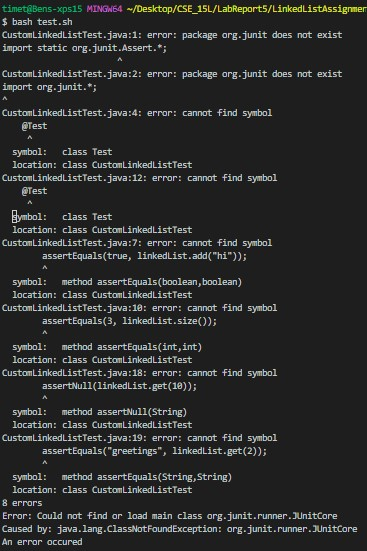
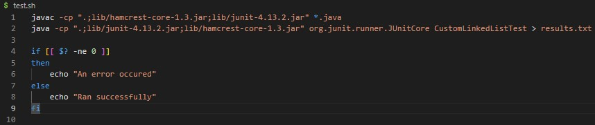

# Lab Report 5

## Part 1 - Debugging Senerio
<b> Something wrong with test.sh bash script </b>
<br> Hi! I am trying to write a bash script that compiles and runs JUnit tests on my ```CustomLinkedList.java``` file. It should put the output of the test runs into
a text file called ```results.txt```. But I am getting error messages in the terminal that make me think it is not recongizing JUnit. 
<br>
Here is the terminal output when I run ```bash test.sh``` on my terminal:

<br>
This is the ```test.sh``` script I wrote:
<br>

<br>
This is my JUnit test file:
<br>

<br>
This is the directory's structure:
<br>

<br>
This is my Linked List implementation I am trying to test:
<br>


## Part 2 - Reflection
Something that really interested me that I learned this half of the qauter had to do with exit codes and using them to our advantage in bash.
I did not know that "under the hood" java returns an exit code until in lecture we talked about how java will return an exit code of zero if
the programing ran successfully or a number other then zero if something went wrong. We used this in bash scripts with the variable ```$?``` to see if
the program ran correctly. This has a lot of useful applications in bash scripts that deal with runing programs, even using the ```$?``` variable to find
out why the program failed if we know the possible failures that the programs we are running could result in and give meaningful feedback in an
more automated way.
